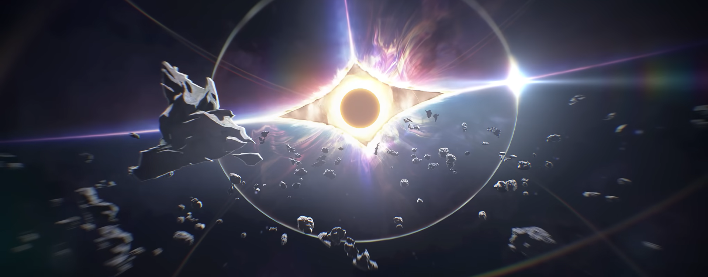
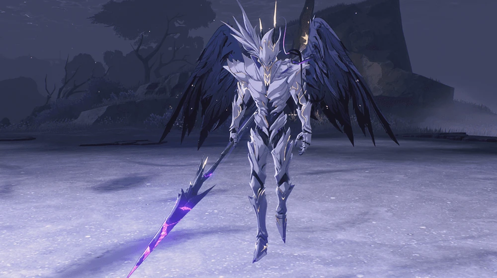

# Prologue Act 1 Utterance of Marvels: I

Rover is seen floating in space with an unknown entity, let's address her as Goddess. 
Everything begins the instant the Goddess retrieves something from inside the Rover's chest and transfers that to Rover's hand causing their awakening as a **Resonator** and the reveal of a **Tacet Mark**.

In the next instant we see the Goddess pushing Rover away into space as she gracefully smiles. The space started to distort with Rover being sucked into a gateway where we can see the reverberations or frequencies while they fall into a lake emitting reverberations as they touch the surface of it.

After this journey through frequencies, Rover find themself in **Solaris-3** near **Gorges of Spirits**. As they regain consciousness, they meet **Yangyang** and **Chixia**. While explaining, Rover states that they have lost their memories and don't remember anything about their past and identity. 
This is the first time where **Yangyang** and **Chixia** decide to refer them as Rover as they set off for **Jinzhou**, one of the 6 major cities in **Huanglong**.

While passing through **Gorges of Spirits**, you see a person standing next to what is called a **Tacet Field** and are a companion with **Yangyang** and **Chixia** called **Baizhi**.
As Baizhi finished examining Rover, she advised to set-off for **Jinzhou** as Tacet Fields are extremely dangerous. In that event, an overlord class Tacet Discord **Crownless** emerges from it and engages Rover. 

At the end of the fight as Rover emerges victorious, they absorb the reverberation of Crownless also called an **Echo** with their bare hands which is an impossible feat for any resonator.
>Resonators can only absorb echoes through **Pangu Terminal** as brought up by Yangyang, Chixia and Baizhi.

It is revealed that a great Hero in the past absorbed a **Threnodian** with their bare hands. 